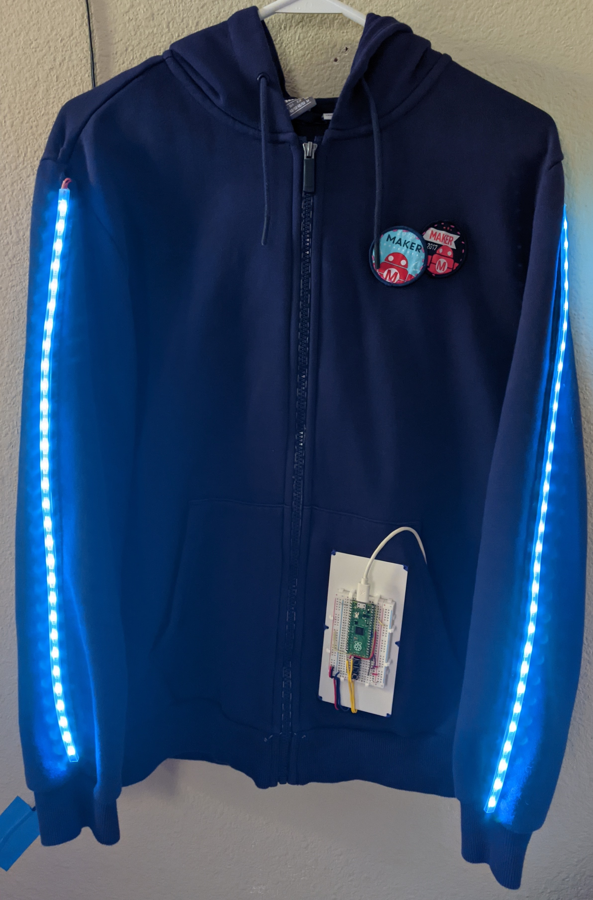
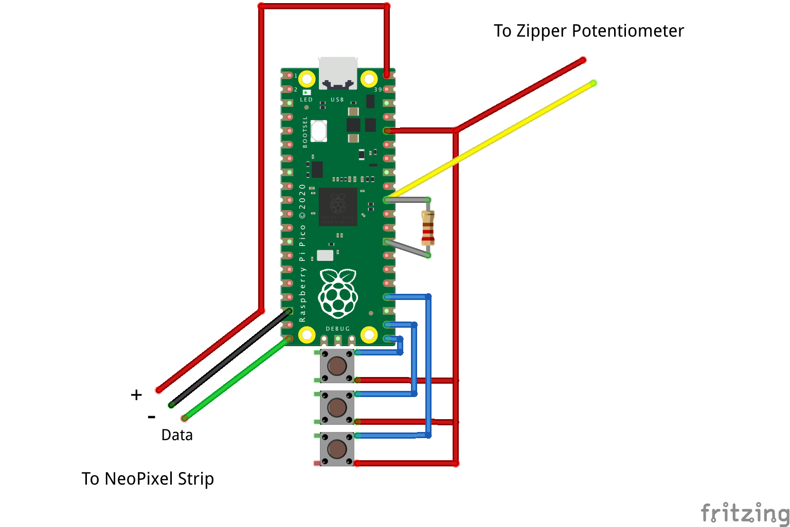

# HSL Jacket - Revisited!

[5 years ago, I had the idea of making a jacket with lights you could control using the zipper](https://www.hackster.io/tctree333/hsl-jacket-f849da). I was inspired after reading about the [Million Color HSL Flashlight](https://makezine.com/projects/million-color-hsl-flashlight/) in Make: Magazine, and thought I could do something similar. I got the materials, sewed in the wires, mounted the elcetronics, but there was one problem: there was not enough voltage to power the LEDs. I did get the LEDs to light up by "cheating" and powering them directly, bypassing the microcontroller, but the fact that it didn't do what I wanted it to do (control via zipper) stuck with me.

This summer, I had some extra time and decided it was finally time to make 12 year old me proud. While the zipper control is not perfect, it does work, and I'm really happy with how it turned out.

## Materials Used

### Hardware

- Jacket (with metal zipper slide thing, not the teeth)
- Raspberry Pi Pico
- 1 meter of Mini Skinny NeoPixel LED Strip (30 LED/m)
- 22 ohm resistor
- 3 momentary push buttons
- Solid core wire
- Flexible silicone stranded wire
- Male/Female jumpers
- Heat shrink tubing
- Velcro
- Normal thread
- Conductive thread
- Superglue
- USB powerbank

### Tools

- Sewing needle
- Soldering iron
- 3D printer (optional)
- Wire cutters/strippers
- Scissors
- Hot glue gun

## Modifications from the original project

For a more detailed step-by-step guide, check out the [original project](https://www.hackster.io/tctree333/hsl-jacket-f849da).

1. First, I swapped all the wiring runs to use a more flexible stranded-core silicone wire. This made the jacket much more confortable to wear. I would recommend using actual wire instead of conductive thread, since conductive thread has a much higher resistance and will cause a siginificant voltage drop. The silicone wire was spliced with some solid core before reaching the breadboard to make it easier to manage.
2. Wiring runs followed seams more closely, and were sewed onto the existing seams on the inside of the jacket. This made the wiring much less visible while also preventing tangles. Wires were also braided together.
3. The microcontroller was swapped from the Maxim Integrated NAX32630FTHR to the Raspberry Pi Pico. I've been using the Pico a lot lately since it's really cheap and runs CircuitPython, making progamming much easier.
4. The electronics were mounted on a breadboard, which was then mounted on a 3D printed bracket. I did really like the original leather mount, but I didn't want to desolder the headers on the Pico and I think wiring would've been messier. I also recently got a 3D printer and wanted to try using it for an actual project.
   1. The bracket was designed in OnShape, which I still need to get better at. It took a couple tries before I got the mounting system right.
5. The most important change was the switch from generic RGB LEDs to NeoPixels. They're individually addressable, with power and data on separate lines. This allows me to power the LEDs off the 5V rail from USB, and control them using the Pico's 3.3V logic. I also chose the skinny NeoPixel strips, giving the arms more flexibility.
   1. Note that the two NeoPixel strips are wired in parallel, which means both arms will be identical if you are animating them.

What didn't actually change was the zipper control. Essentially, the zipper acts as a potentiometer, with the slider changing the length of conductive thread with current. Although the resistance jumps around a lot, especially when moving the zipper, I was able to smooth it out a little in software. I used a 22 ohm resistor as part of the voltage divider since that was similar to the range of resistances I was getting from the zipper.

## Schematic

